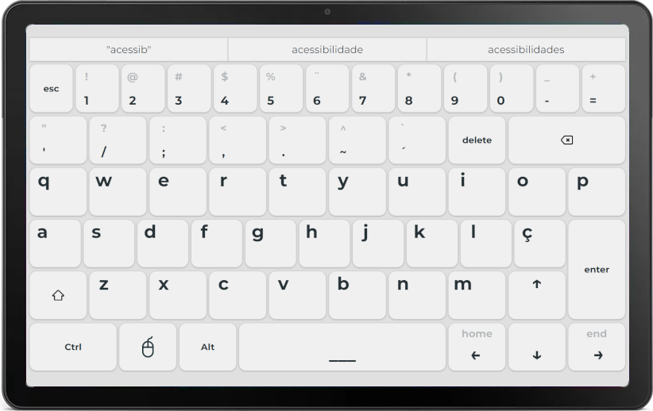

# ⌨️ Projeto THL - Teclado Helena

Teclado virtual com foco em acessibilidade.

O Teclado Helena é um teclado virtual com foco em acessibilidade, que pode ser facilmente instalado em PCs e operado remotamente através de um tablet. Desenvolvido para atender às necessidades de pessoas com coordenação motora limitada, o teclado implementa recursos que tornam a digitação uma tarefa mais acessível e menos frustrante.

## ✨ Recursos

- Teclas maiores
- Supressão de caracteres repetidos no pressionamento longo
- Modo "Teclas de aderência" nas teclas Ctrl, Shift e Windows
- Feedback sonoro com fala da tecla pressionada
- Feedback físico em tablets com suporte a vibração
- Sugestão de palavras com autocompletar
- Modo mouse com touchpad e rolagem

## 📦 Instalação

1. Na página de [Releases](https://github.com/iptsp/teclado-helena/releases/latest), clique em `teclado-helena.msi` para iniciar o download do instalador mais recente.

2. Abra o instalador baixado. Se necessário, permita que o aplicativo faça alterações em seu dispositivo.

## 🖥️ Uso

1. Certifique-se que o tablet e seu computador estão na mesma rede Wi-Fi.

2. Abra o teclado pelo atalho na Área de trabalho ou menu Iniciar. Se necessário, permita que o aplicativo faça alterações em seu dispositivo.

3. Escaneie o QR Code exibido com o tablet.

## 🛠️ Desenvolvimento

Para instruções de desenvolvimento, consulte [DEVELOP.md](DEVELOP.md)